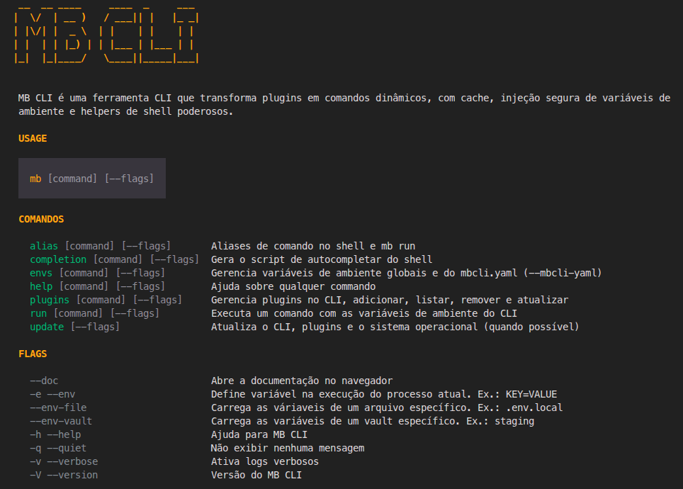

# MB CLI

Ferramenta de linha de comando para gerir plugins e comandos personalizados no seu ambiente.



## Documentação

Tudo sobre instalação, uso diário, plugins e opções está no site:

**https://carlosdorneles-mb.github.io/mb-cli/**

Sugestão de entrada: [Começar](https://carlosdorneles-mb.github.io/mb-cli/docs/getting-started).

## Desenvolvimento local

É necessário [Go](https://go.dev/dl/) (versão em `go.mod`) e `make`.

```bash
git clone https://github.com/carlosdorneles-mb/mb-cli.git
cd mb-cli
make build          # gera bin/mb
./bin/mb --help
```

Para executar sem gravar o binário: `make run-local -- --help` (ou `make run` depois de `make build`). Testes: `make test`.

Opcional — registar os plugins de exemplo do repositório e atualizar o cache:

```bash
make install-plugins-examples
./bin/mb plugins sync
```

## Arquitetura

O projeto segue **Clean Architecture** com injeção de dependência via [`go.uber.org/fx`](https://pkg.go.dev/go.uber.org/fx).

```
internal/
├── bootstrap/      # Composição raiz — monta a FX App
├── cli/            # Camada de apresentação (Cobra apenas)
├── usecase/        # Casos de uso — lógica de negócio pura
├── domain/         # Modelos de domínio
├── infra/          # Adapters concretos (SQLite, Git, FS, etc.)
├── ports/          # Interfaces (contratos entre camadas)
├── module/         # Módulos Fx — wire de dependência
├── fakes/          # Test doubles para testes unitários
└── shared/         # Utilitários transversais (config, UI, version)
```

**Fluxo de dependência** (aponta para o centro):

```
cli → usecase → domain
  ↘            ↗
   infra → ports
```

### Princípios

| Princípio | Descrição |
|---|---|
| **Cobra é thin** | `RunE` tem ≤ 5 linhas: parse flags, chama usecase, exibe resultado |
| **Interfaces no centro** | `ports/` define contratos; `infra/` implementa |
| **Logger por chamada** | Logger é passado por parâmetro, não injetado no constructor |
| **Zero variáveis globais** | Tudo injetado via Fx ou parâmetro |
| **Testes com fakes** | `internal/fakes/` para unitários; SQLite real para integração |

Para detalhes, veja [`internal/README.md`](internal/README.md).

## Contribuir

Abre um *issue* para ideias ou bugs. Para código ou documentação: *fork*, ramo com alterações focadas e *pull request* contra `main`. O CI e a revisão seguem o fluxo habitual do repositório; pormenores de versões e release estão na documentação do projeto.
