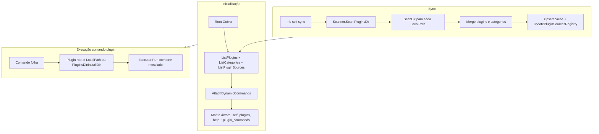

# Arquitetura

Esta página descreve, em alto nível, como o MB CLI está organizado para quem quiser contribuir ou entender o fluxo de execução.

## Entrada e árvore de comandos

O CLI usa [Cobra](https://github.com/spf13/cobra) para a árvore de comandos. O **root command** (`mb`) possui dois grupos:

- **Comandos built-in** — `self` (sync, env, completion), `plugins` (add, list, remove, update), `help`, etc.
- **Comandos de plugins** — Montados dinamicamente a partir do cache; todos recebem o mesmo `GroupID` ("plugin_commands") para que apareçam agrupados no help.

Na inicialização, o CLI lê o cache SQLite, obtém a lista de plugins e categorias, e chama **AttachDynamicCommands**: para cada plugin no cache, cria os nós da árvore (categorias como subcomandos intermediários e o plugin como comando folha). Assim, não é necessário escanear o disco a cada execução.

## Cache SQLite

O cache fica em `~/.config/mb/cache.db` (ou equivalente no macOS). Tabelas relevantes:

- **plugins** — Um registro por comando de plugin: `command_path`, `command_name`, `description`, `exec_path`, `plugin_type`, `config_hash`, `readme_path`, `flags_json`. O `command_path` é o caminho lógico na árvore (ex.: `tools/hello`, `infra/ci/deploy`).
- **categories** — Uma por pasta que só tem manifesto de categoria (sem entrypoint): `path`, `description`, `readme_path`.
- **plugin_sources** — Um registro por “instalação” (nome do plugin): `install_dir`, `git_url`, `ref_type`, `ref`, `version`, `local_path`. Quando `local_path` está preenchido, o plugin é local (o código fica nesse path; não em `PluginsDir`). Quando `git_url` está preenchido, o plugin foi instalado por clone Git em `PluginsDir`.

O cache é **escrito** quando alguém roda `mb self sync` (ou após `plugins add/remove/update`). O sync primeiro garante os helpers de shell em `ConfigDir/lib/shell` (cria ou atualiza por checksum); em seguida escaneia o diretório de plugins e, para cada source com `local_path`, escaneia esse diretório; faz merge e upsert em `plugins` e `categories`, e atualiza `plugin_sources` para novos diretórios (preservando `local_path` e `git_url` existentes).

O cache é **lido** na inicialização do CLI para montar a árvore de comandos e, em tempo de execução, para resolver o path do executável (PluginsDir + command_path ou local_path, conforme o caso).

## Fluxo de execução de um comando de plugin

1. O usuário invoca `mb <categoria> <comando> [args...]`.
2. Cobra roteia para o comando folha correspondente, que foi criado em **AttachDynamicCommands**.
3. O handler do comando folha (entrypoint ou flags-only) obtém o **plugin root**: se o plugin tem `local_path` em `plugin_sources`, usa esse path; senão, usa `filepath.Join(PluginsDir, installDir)`.
4. Para plugins com **entrypoint**: o `ExecPath` já está absoluto no cache (vindo do scan). O executor invoca o script ou binário com os argumentos e o ambiente mesclado (sistema + defaults + `--env-file` + `--env`).
5. Para plugins **flags-only**: o handler monta o `exec_path` a partir do plugin root + segmentos do `command_path` + entrypoint da flag escolhida; em seguida chama o executor.

O **executor** é o componente que, dado um `Plugin` (com `ExecPath` e `PluginType`), monta a linha de comando (por exemplo `/bin/sh` + script quando o entrypoint termina em `.sh`) e executa o processo com o ambiente injetado.

## Diagrama de alto nível

Para detalhes da descoberta (scanner, manifest, validação), do formato do cache e da resolução de paths, veja [Plugins](./plugins.md). Para a tabela de comandos e flags, veja [Referência de comandos](./reference.md).
