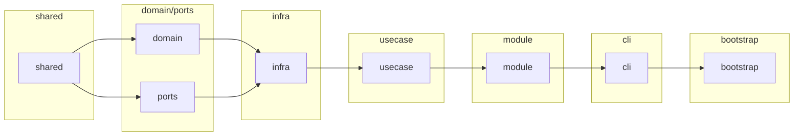
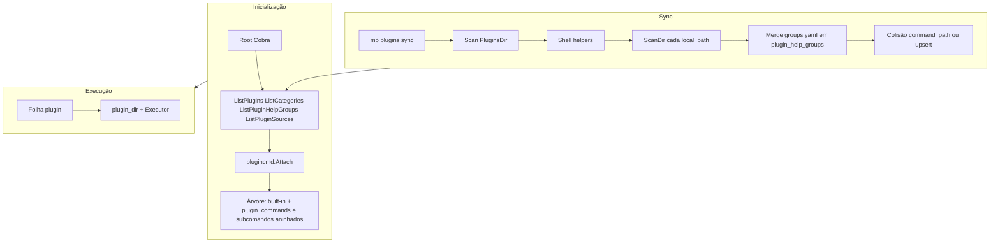

# Arquitetura

Esta página descreve, em alto nível, como o MB CLI está organizado. Para detalhes de scanner, `groups.yaml` e cache, veja [Plugins](./plugins.md).

## Estrutura de código (`internal/`)

O projeto segue **Clean Architecture** com injeção de dependência via [Uber FX](https://uber-go.github.io/fx/):

```
internal/
├── bootstrap/          # Composição raiz — fx.New + fx.Populate(&rootCmd)
├── cli/                # Camada de apresentação (Cobra, thin)
│   ├── root/           #   Root command + flags globais
│   ├── envs/           #   mb envs (list, set, unset, vaults)
│   ├── plugins/        #   mb plugins (add, list, remove, update, sync)
│   ├── plugincmd/      #   Comandos dinâmicos gerados do cache
│   ├── completion/     #   mb completion (install, uninstall, generate)
│   ├── run/            #   mb run <processo>
│   ├── update/         #   mb update
│   └── runtimeflags/   #   Flags de runtime injetadas nos plugins
├── usecase/            # Casos de uso / regras de aplicação
│   ├── addplugin/      #   Instalar plugins (remoto/local)
│   ├── envs/           #   Coleta e merge de variáveis de ambiente
│   ├── plugins/        #   Sync, remoção, atualização de plugins
│   └── update/         #   Orquestração de self-update e tools update
├── domain/             # Modelos de domínio puros (Plugin, Category, HelpGroup)
├── ports/              # Interfaces (contratos) — centro da Clean Architecture
├── infra/              # Implementações concretas (adapters)
│   ├── browser/        #   Abrir URLs no navegador
│   ├── executor/       #   ScriptExecutor (bash/binário)
│   ├── fs/             #   Filesystem real (os.MkdirAll, os.Stat, …)
│   ├── keyring/        #   SecretStore via go-keyring
│   ├── opcli/          #   Integração com 1Password CLI
│   ├── plugins/        #   Git, scanner de manifest, hash de config
│   ├── selfupdate/     #   Self-update via GitHub Releases
│   ├── shellhelpers/   #   Scripts utilitários embarcados
│   └── sqlite/         #   Persistência SQLite
├── module/             # Módulos FX (wire de dependência)
├── deps/               # Configuração de runtime (paths, flags, Dependencies)
├── shared/             # Utilitários transversais (config, env, safepath, system, ui, version)
└── fakes/              # Test doubles (FakeFS, FakeGit, FakeLogger, …)
```

**Fonte de verdade** para nomes de pacotes, camadas e regras de import: ficheiro **`internal/README.md`** no repositório.

### Fluxo de dependência

```
cli → usecase → ports ← infra
  ↑                    ↑
deps ──────────── module (Fx wire)
```

- **`cli/`** é fino: `RunE` parse args, chama usecase, exibe resultado.
- **`usecase/`** depende apenas de interfaces (`ports/`), nunca de implementações concretas.
- **`infra/`** implementa as interfaces de `ports/` usando bibliotecas reais (SQLite, os/exec, git, keyring).
- **`module/`** conecta interfaces às implementações via FX.
- **`deps/`** agrega as dependências injetadas nos comandos (`RuntimeConfig`, `Paths`, `Dependencies`).
- **`fakes/`** implementações de teste das interfaces de `ports/`.

Ordem de leitura para contribuidores: `domain` / `ports` → `infra` → `usecase` → `deps` + `module` → `cli` → `bootstrap`.



## Entrada e árvore de comandos

O CLI usa [Cobra](https://github.com/spf13/cobra). O **root command** (`mb`) combina:

- **Comandos built-in** — `plugins` (add, list, remove, update, sync), `envs` (list, set, unset, vaults), `run`, `update`, `completion`, `help`, `--doc`.
- **Comandos de plugins** — Registados em runtime a partir do cache SQLite via **`plugincmd.Attach`** (não há scan ao disco em cada execução).

Na inicialização, o CLI lê o cache: **`ListPlugins`**, **`ListCategories`**, **`ListPluginHelpGroups`** e **`ListPluginSources`**, monta categorias como subcomandos intermédios e cada plugin como folha.

**Grupos no help (Cobra):**

- Comandos de categoria **logo abaixo da raiz `mb`** (ex. `mb infra`) ficam no grupo **COMANDOS DE PLUGINS** (`plugin_commands`).
- Subcomandos **aninhados** (ex. `mb infra ci deploy`): por defeito **COMANDOS** (`commands`); se o manifest tiver **`group_id`** válido em **`plugin_help_groups`**, aparecem na secção com o título definido em `groups.yaml` (merge global no sync). Ver [Plugins — Grupos de help](./plugins.md#grupos-de-help-groupsyaml-group_id-e-cobra).

## Cache SQLite

O cache fica em **`ConfigDir/cache.db`** (ex. `~/.config/mb/cache.db` no Linux; `~/Library/Application Support/mb/cache.db` no macOS). Tabelas relevantes:

- **plugins** — `command_path`, `command_name`, `plugin_dir`, `exec_path`, `group_id` (help; só aninhados).
- **categories** — `path`, descrição, `readme_path`, `hidden`, `group_id` (help para categorias aninhadas).
- **plugin_help_groups** — `group_id` → `title` (registo global fundido a partir de todos os `groups.yaml` no sync).
- **plugin_sources** — Por instalação: `install_dir`, `git_url`, ref, versão, **`local_path`**. Com `local_path` preenchido, o código é lido desse path; com `git_url`, clone em `PluginsDir`.

O cache é **escrito** em `mb plugins sync` (e após `plugins add/remove/update`). O fluxo inclui scan de `PluginsDir` e de cada `local_path`, merge de grupos de help, normalização de `group_id`, verificação de colisão de `command_path`, e recriação de tabelas. **`plugin_sources` não é alterado pelo sync** (só por `plugins add/remove/update`).

O cache é **lido** na inicialização para montar a árvore de comandos.

## Fluxo de execução de um comando de plugin

1. O utilizador invoca `mb <categoria> … <comando> [args…]`.
2. O Cobra encaminha para o comando folha criado em **`plugincmd.Attach`**.
3. O handler resolve o plugin via cache (`plugin_dir` / `exec_path`).
4. Com **entrypoint**: o **executor** (`infra/executor`) invoca o processo (ex. **bash** + script se terminar em `.sh`).
5. **Flags-only**: o entrypoint da flag é resolvido dentro de `plugin_dir`.

## Diagrama de alto nível



Para detalhes do scanner, validação, sync passo a passo e flags, veja [Plugins](./plugins.md).
