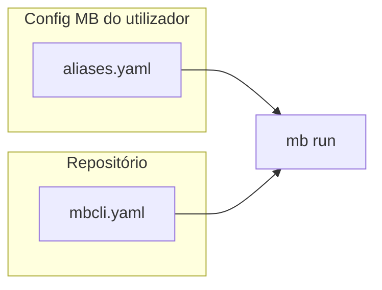
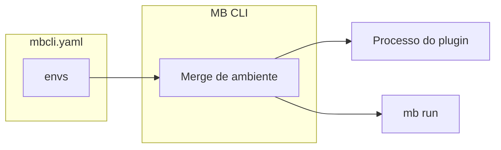

# `mbcli.yaml` no repositório

O ficheiro **`mbcli.yaml`** é a configuração **opcional e versionada** do projeto usada pelo MB CLI para:

1. **Mesclar variáveis** na chave **`envs`** — o mesmo merge que entra em **plugins** e em **`mb run`** (junto com `env.defaults`, vaults em disco, flags `--env`, etc.; ordem completa em [Variáveis de ambiente](./environment-variables.mdx)).
2. **Resolver atalhos** na chave **`aliases`** — só em **`mb run <nome>`** e na listagem **`mb alias list`**; **não** gera funções no perfil do shell (isso continua a vir só de `aliases.yaml`).

Objetivo prático: **partilhar** defaults de ambiente e atalhos com a equipa via Git, sem depender só da cópia local no **diretório de configuração do MB** no teu equipamento (esse caminho **varia por sistema operativo** — ver [Instalação — Diretórios por sistema operacional](../getting-started/installation.mdx#diretórios-por-sistema-operacional)).

---

## Onde o ficheiro fica (resolução do caminho)

O MB resolve um **único** caminho absoluto, alinhado ao helper de plugins **`mbcli-yaml`** (ver [Helpers de Shell — mbcli-yaml](../plugin-authoring/shell-helpers.mdx#mbcli-yaml)):

| Prioridade | Origem |
|------------|--------|
| 1 | Se **`MBCLI_YAML_PATH`** estiver definida, usa esse valor (caminho relativo é interpretado em relação ao **diretório atual**). |
| 2 | Caso contrário: **`${MBCLI_PROJECT_ROOT}/mbcli.yaml`**. Se **`MBCLI_PROJECT_ROOT`** estiver vazia, usa a raiz **`.`** (ou seja, o cwd). Raiz `.` é tratada como o cwd; raiz relativa é unida ao cwd e normalizada. |
| Final | O caminho é sempre **absoluto** e **normalizado** (`filepath.Clean`). |

O ficheiro **pode não existir**; nesse caso vários comandos tratam-no como vazio ou criam-no no primeiro `set` com `--mbcli-yaml`.

---

## Chaves usadas pelo MB CLI

### `envs`

- **Escalares na raiz** do mapa `envs` → vault lógico **`project`** (sempre mesclados; listar com `mb envs list --vault project`).
- **Sub-mapas** (`envs.<nome>` com valores escalares) → vault lógico **`project/<nome>`** (merge quando usas `--env-vault <nome>` na execução; listar com `mb envs list --vault project/<nome>`).

Restrições importantes:

- Valores são **sempre em texto** no YAML. **`mb envs set --mbcli-yaml`** **não** pode ser combinado com **`--secret`** nem **`--secret-op`**.
- Os nomes **`project`** e o prefixo **`project/`** são **reservados** em contextos de vault **em disco** (`mb envs set` sem `--mbcli-yaml`); no modo `--mbcli-yaml` usa **sem** `--vault` para a raiz de `envs`, ou **`--vault <submapa>`** só com o nome do submapa (ex.: `staging`). Detalhes em [Vaults de projeto](./environment-variables.mdx#project-vaults).

### `aliases`

Formato e precedência estão descritos em [`mb alias` — Aliases em mbcli.yaml](../commands/alias.mdx#aliases-em-mbcliyaml-repositório). Resumo:

- Cada entrada é um **slot nome + vault** (`env_vault`); na listagem JSON, o vault de projeto usa os mesmos rótulos **`project`** / **`project/<nome>`** que em `mb envs list`.
- Se o **mesmo** nome e vault existirem em **`aliases.yaml`** e em **`mbcli.yaml`**, prevalece a definição do **`mbcli.yaml`**.





### Outras chaves no ficheiro (tooling / plugins)

Para além de **`envs`** e **`aliases`**, o YAML pode conter outras chaves de **configuração de projeto** que o MB CLI **não** interpreta nos comandos `mb envs` / `mb alias` / listagens — o núcleo limita-se ao que está documentado acima. Essas chaves podem ser **lidas por plugins** (shell com helper **`mbcli-yaml`**) ou por scripts teus.

- Exemplo documentado nesta página: **`portForward`**, usada pelo plugin **`mb dev k8s pf`**. **Não** participa do merge de variáveis descrito em [Variáveis de ambiente](./environment-variables.mdx) da mesma forma que **`envs`**; o plugin abre o ficheiro e interpreta o mapa (com fallbacks; vê as secções seguintes sobre **leitura** e **plugins que alteram**).

**Âmbito da doc:** as tabelas que citam comandos concretos de **leitura directa** no disco referem-se ao pacote **mb-cli-plugins** usado como referência neste guia. **Outros** repositórios instalados com **`mb plugins add`** podem usar o mesmo caminho (`mbcli_yaml_path` / `yq`) e **outras** chaves; não estão listados exhaustivamente aqui.

---

## Exemplo mínimo (`mbcli.yaml`)

```yaml
envs:
  NODE_ENV: development
  staging:
    API_URL: https://api.example.com

aliases:
  # Vault lógico "project" (raiz de envs): alias na raiz de `aliases` = lista argv
  dev-up:
    - docker
    - compose
    - up
  # Vault lógico "project/staging" (submapa envs.staging): grupo = nome do submapa
  staging:
    api-smoke:
      - curl
      - -s
      - https://api.example.com/health

# Opcional: Kubernetes port-forward (plugin mb dev k8s pf)
# portForward:
#   REDIS: svc/common-services:6379:6379
```

O `mb alias set … --mbcli-yaml` grava sobretudo esta **forma curta** (listas). A **forma longa** (`command:` como lista e `env_vault` opcional) também é aceite pelo parser se editares à mão — ver [Aliases em `mbcli.yaml` (repositório)](../commands/alias.mdx#aliases-em-mbcliyaml-repositório).

---

## Quem **lê** o `mbcli.yaml` (CLI e plugins)

### Comandos MB CLI

| Comando | Uso |
|---------|-----|
| **`mb envs list`** | Mostra variáveis dos vaults lógicos `project` / `project/<nome>` (armazenamento **projeto**). |
| **`mb envs vaults`** | Lista linhas de vault incluindo `project` e `project/<nome>` quando o YAML tem `envs`. |
| **`mb alias list`** | Junta linhas de **`aliases.yaml`** com as do **`mbcli.yaml`** (coluna de origem / `source`). |
| **`mb run`** | Mescla `envs` e resolve o primeiro token como alias global ou de repositório. |

### Plugins (**mb-cli-plugins**)

Qualquer execução de **`mb …`** que arranque um **plugin** corre o processo com o **mesmo ambiente mesclado** que o MB CLI usa nesse projeto — logo, os valores da chave **`envs`** deste ficheiro entram no processo como vault lógico **`project`** / **`project/<nome>`** quando o YAML existe (ordem e detalhes em [Variáveis de ambiente](./environment-variables.mdx); visão geral no primeiro ponto da introdução acima). O script do plugin **não precisa** de abrir o YAML para receber essas variáveis.

No pacote **mb-cli-plugins**, há também **leitura directa** do ficheiro (via helper **`mbcli-yaml`**, mesmo caminho que em [Onde o ficheiro fica](#onde-o-ficheiro-fica-resolução-do-caminho)):

| Comando | O que lê no `mbcli.yaml` |
|---------|--------------------------|
| **`mb dev k8s pf`** (`port-forward` / **`pf`**) | Chave **`portForward`**; fallbacks `.env.ports` e `PF__*` estão resumidos na linha **Sem `--init`** de [Plugins que alteram o ficheiro](#plugins-mb-cli-alteram). |
| **`mb dev k8s pf --init`** | Antes de eventualmente **escrever**, lê o YAML para saber se `portForward` já está preenchido (mesma secção). |

---

## Comandos que **alteram** o `mbcli.yaml`

Estes subcomandos **regravam** o ficheiro (ou criam-no). Ao regravar, o MB pode **alterar a ordem das chaves** e **não preservar comentários** no YAML. A mesma ressalva aplica-se a **escrita com `yq`** feita por plugins (ver abaixo).

| Comando | O que faz |
|---------|-----------|
| **`mb envs set --mbcli-yaml`** | Escreve ou atualiza variáveis na chave **`envs`** (raiz ou submapa com `--vault <nome>`). Confirmações em alterações a valores existentes; em CI usa **`--yes`**. |
| **`mb envs unset --mbcli-yaml`** | Remove chaves em **`envs`**. Em modo não interativo exige **`--yes`**. |
| **`mb alias set --mbcli-yaml`** | Escreve ou atualiza entradas na chave **`aliases`**. **Não** regenera scripts em `shell/`. |
| **`mb alias unset --mbcli-yaml`** | Remove aliases em **`aliases`** (lote com confirmação; **`--yes`** em scripts). |

Outros subcomandos de `mb envs` / `mb alias` ou o **`mb run`** não escrevem este ficheiro pelo fluxo normal do CLI.

### Plugins (**mb-cli-plugins**) que **alteram** o ficheiro {/* #plugins-mb-cli-alteram */}

No repositório de plugins, **só** o comando **Kubernetes port-forward** (`port-forward`, atalho **`pf`**) **regrava** `mbcli.yaml`, e **apenas** quando corres explicitamente:

**`mb dev k8s pf --init`**

(atalho equivalente a `mb dev k8s port-forward --init`.)

| Momento | Comportamento |
|---------|----------------|
| **`--init`** | Cria `mbcli.yaml` ou preenche a chave **`portForward`** com um mapa predefinido de serviços (via `yq`, alinhado ao caminho da secção [Onde o ficheiro fica](#onde-o-ficheiro-fica-resolução-do-caminho) e ao helper **`mbcli-yaml`**). Vale a mesma ressalva que em cima: **ordem de chaves** e **comentários** podem não ser preservados. |
| **Sem `--init`** (`mb dev k8s pf` …) | **Só leitura** da chave `portForward` (com fallback para `.env.ports` / variáveis `PF__*`); **não** altera o YAML. |

Regras do `--init` em resumo:

- Se **`mbcli.yaml` já existir** e **`portForward`** tiver **pelo menos uma** entrada válida → o ficheiro **não** é alterado.
- Se `portForward` estiver **ausente**, for **`null`**, **não** for um mapa ou for um mapa **vazio** → **preenche** `portForward` com os valores predefinidos.
- Se **`mbcli.yaml` não existir** → **cria** o ficheiro com `portForward`, **exceto** se já existir **`.env.ports`** (ou o caminho em **`MB_PF_PORTS_FILE`**): nesse caso **não** cria nem altera o YAML até removeres/renomeares `.env.ports` ou criares `mbcli.yaml` manualmente.

Noutros plugins do pacote, referências a `mbcli.yaml` são **leitura** (ex.: o mesmo port-forward em execução normal) ou **apenas documentação** nos README (ex.: sugerir `envs` no YAML); **não** há mais entrypoints que escrevam neste ficheiro.

---

## Ver também

- [Variáveis de ambiente](./environment-variables.mdx) — ordem de merge, exemplos e tabela “Quando usar o quê”
- [`mb envs`](../commands/envs.mdx) — referência de flags (`--mbcli-yaml`, `--vault`, etc.)
- [`mb alias`](../commands/alias.mdx) — formato de `aliases`, perfil do shell e `--mbcli-yaml`
- [`mb run`](../commands/run.mdx) — execução com o mesmo ambiente dos plugins
- [Helpers de Shell — mbcli-yaml](../plugin-authoring/shell-helpers.mdx#mbcli-yaml) — resolver o caminho, **ler** o ficheiro e **editar** com `yq` a partir de plugins
