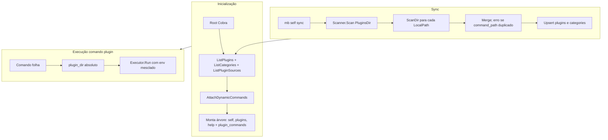

# Arquitetura

Esta página descreve, em alto nível, como o MB CLI está organizado para quem quiser contribuir ou entender o fluxo de execução.

## Entrada e árvore de comandos

O CLI usa [Cobra](https://github.com/spf13/cobra) para a árvore de comandos. O **root command** (`mb`) possui dois grupos:

- **Comandos built-in** — `self` (sync, env, completion), `plugins` (add, list, remove, update), `help`, etc.
- **Comandos de plugins** — Montados dinamicamente a partir do cache; todos recebem o mesmo `GroupID` ("plugin_commands") para que apareçam agrupados no help.

Na inicialização, o CLI lê o cache SQLite, obtém a lista de plugins e categorias, e chama **AttachDynamicCommands**: para cada plugin no cache, cria os nós da árvore (categorias como subcomandos intermediários e o plugin como comando folha). Assim, não é necessário escanear o disco a cada execução.

## Cache SQLite

O cache fica em `~/.config/mb/cache.db` (ou equivalente no macOS). Tabelas relevantes:

- **plugins** — Inclui `command_path`, `command_name`, `plugin_dir` (pasta do manifest), `exec_path`, etc. O `command_path` reflete só a árvore do pacote, sem o nome da instalação.
- **categories** — Uma por pasta que só tem manifesto de categoria (sem entrypoint): `path`, `description`, `readme_path`.
- **plugin_sources** — Um registro por “instalação” (nome do plugin): `install_dir`, `git_url`, `ref_type`, `ref`, `version`, `local_path`. Quando `local_path` está preenchido, o plugin é local (o código fica nesse path; não em `PluginsDir`). Quando `git_url` está preenchido, o plugin foi instalado por clone Git em `PluginsDir`.

O cache é **escrito** quando alguém roda `mb self sync` (ou após `plugins add/remove/update`). O sync garante os helpers; escaneia cada subdiretório de `PluginsDir` e cada `local_path`; faz merge; falha se houver **conflito** de `command_path` entre fontes; upsert em `plugins` e `categories`. **`plugin_sources` não é preenchido automaticamente pelo sync** a partir dos comandos descobertos.

O cache é **lido** na inicialização para montar a árvore; na execução usa-se `ExecPath`/`plugin_dir` absolutos.

## Fluxo de execução de um comando de plugin

1. O usuário invoca `mb <categoria> <comando> [args...]`.
2. Cobra roteia para o comando folha correspondente, que foi criado em **AttachDynamicCommands**.
3. O handler usa **`plugin_dir`** do cache como diretório raiz do plugin (fallback legado: derivação por `command_path` + fonte).
4. Para plugins com **entrypoint**: `ExecPath` já é absoluto. O executor invoca o processo com o ambiente mesclado.
5. Para plugins **flags-only**: o entrypoint da flag é resolvido dentro de `plugin_dir`.

O **executor** é o componente que, dado um `Plugin` (com `ExecPath` e `PluginType`), monta a linha de comando (por exemplo **bash** + script quando o entrypoint termina em `.sh`) e executa o processo com o ambiente injetado.

## Diagrama de alto nível

Para detalhes da descoberta (scanner, manifest, validação), do formato do cache e da resolução de paths, veja [Plugins](./plugins.md). Para a tabela de comandos e flags, veja [Referência de comandos](./reference.md).
