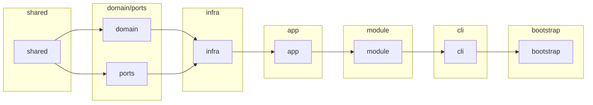
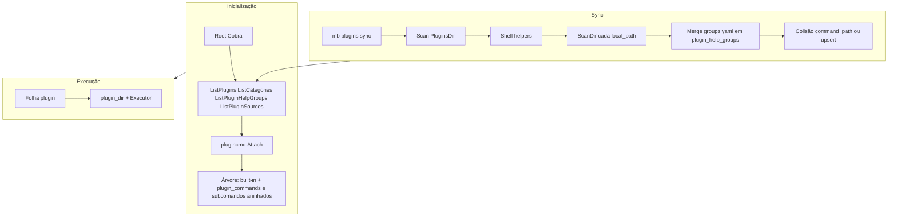

# Arquitetura

Esta página descreve, em alto nível, como o MB CLI está organizado para quem quiser contribuir ou entender o fluxo de execução. Detalhes de scanner, `groups.yaml` e cache estão em [Plugins](./plugins.md).

## Estrutura FX (internal/)

O código em `internal/` segue uma organização orientada a [Uber FX](https://uber-go.github.io/fx/):

- **`bootstrap`** — Ponto de entrada da aplicação: `fx.New` com Options que agregam todos os módulos e `fx.Populate(&rootCmd)` para obter o comando Cobra raiz.
- **`module/`** — Módulos FX por contexto: `runtime` (paths, config), `cache`, `plugins`, `executor`, `deps`, `cli`. Cada um expõe um `fx.Option` (ex.: `PathsModule`, `CacheModule`).
- **`cli/`** — Cobra: root, plugins, envs, update, plugincmd (comandos dinâmicos a partir do cache).
- **`app/`** — Use cases (ex.: sync de plugins em `app/plugins`).
- **`infra/`** — Implementações: sqlite (Store), plugins (scanner, Git, manifest), executor, browser, selfupdate, shellhelpers.
- **`shared/`** — Código partilhado sem dependências de negócio: ui, system, safepath, version, env, envgroup, config.
- **`domain/`** — Tipos de domínio (ex.: plugin); **`ports/`** — Interfaces opcionais para desacoplar infra.

Ordem de dependência (evitar ciclos): `shared` → `domain`/`ports` → `infra` → `app` → `module` → `cli` → `bootstrap`. Ver mapa detalhado em `internal/README.md` no repositório.

## Entrada e árvore de comandos

O CLI usa [Cobra](https://github.com/spf13/cobra) para a árvore de comandos. O **root command** (`mb`) combina:

- **Comandos built-in** — `self` (sync, env, completion, …), `plugins` (add, list, remove, update), `help`, etc.
- **Comandos de plugins** — Registados em tempo de arranque a partir do cache SQLite via **`plugincmd.Attach`** (não há scan ao disco em cada execução).

Na inicialização, o CLI lê o cache: **`ListPlugins`**, **`ListCategories`**, **`ListPluginHelpGroups`** e **`ListPluginSources`**, e chama **`plugincmd.Attach`**, que monta categorias como subcomandos intermédios e cada plugin como folha.

**Grupos no help (Cobra):**

- Comandos de categoria **logo abaixo da raiz `mb`** (ex. `mb infra`) ficam no grupo **COMANDOS DE PLUGINS** (`plugin_commands`).
- Subcomandos **aninhados** (ex. `mb infra ci deploy`): por defeito **COMANDOS** (`commands`); se o manifest tiver **`group_id`** válido em **`plugin_help_groups`**, aparecem na secção com o título definido em `groups.yaml` (merge global no sync). Ver [Plugins — Grupos de help](./plugins.md#grupos-de-help-groupsyaml-group_id-e-cobra).

## Cache SQLite

O cache fica em **`ConfigDir/cache.db`** (ex. `~/.config/mb/cache.db` no Linux; equivalente no macOS). Tabelas relevantes:

- **plugins** — Entre outros: `command_path`, `command_name`, `plugin_dir`, `exec_path`, `group_id` (help; só aninhados).
- **categories** — `path`, descrição, `readme_path`, `hidden`, `group_id` (help para categorias aninhadas).
- **plugin_help_groups** — `group_id` → `title` (registo global fundido a partir de todos os `groups.yaml` no sync).
- **plugin_sources** — Por instalação: `install_dir`, `git_url`, ref, versão, **`local_path`**. Com `local_path` preenchido, o código é lido desse path; com `git_url`, clone em `PluginsDir`.

O cache é **escrito** em `mb plugins sync` (e após `plugins add/remove/update`). O fluxo inclui scan de `PluginsDir` e de cada `local_path`, merge de grupos de help, normalização de `group_id`, verificação de colisão de `command_path`, e recriação de `plugins`, `plugin_help_groups` e `categories`. **`plugin_sources` não é alterado pelo sync** (só por `plugins add/remove/update`).

O cache é **lido** na inicialização para montar a árvore; na execução usam-se `ExecPath` / `plugin_dir` absolutos.

## Fluxo de execução de um comando de plugin

1. O utilizador invoca `mb <categoria> … <comando> [args…]`.
2. O Cobra encaminha para o comando folha criado em **`plugincmd.Attach`**.
3. O handler usa **`plugin_dir`** do cache como raiz do plugin (com fallback por `command_path` e fonte).
4. Com **entrypoint**: `ExecPath` absoluto; o **executor** invoca o processo (ex. **bash** + script se terminar em `.sh`).
5. **Flags-only**: o entrypoint da flag é resolvido dentro de `plugin_dir`.

## Diagrama de alto nível

Para detalhes do scanner, validação, sync passo a passo e flags, veja [Plugins](./plugins.md) e [Referência de comandos](./reference.md).
