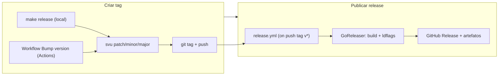

# Versionamento e release

Esta página descreve como a **versão** do MB CLI é definida e como os **releases** (binários publicados) são gerados. É uma referência técnica para quem mantém o projeto ou contribui.

## Modelo de versionamento

- O MB segue [Semantic Versioning](https://semver.org/) (SemVer): **MAJOR.MINOR.PATCH** (ex.: `v1.2.3`).
- A versão é definida por **tags Git** no repositório. Não existe arquivo `VERSION` nem versão hardcoded no código: o número vem sempre da tag usada no build.
- O binário exibe a versão em `mb -V` ou `mb --version`. Esse valor é injetado em tempo de **build** via ldflags (variável `mb/internal/version.Version`). Em desenvolvimento (`go run` ou `make build` sem tag), o CLI mostra `dev`.
- **`mb self update`** (e `--check-only`) só funcionam quando essa variável está definida — ou seja, binários publicados no GitHub Releases. Builds locais recebem um aviso e devem usar `install.sh` ou o asset da release.

## Geração da próxima versão (svu)

O projeto usa o [svu](https://github.com/caarlos0/svu) para calcular a **próxima** versão a partir das tags existentes no repositório.

- **Configuração:** o arquivo `.svu.yml` na raiz do repositório define o prefixo das tags (`tag.prefix: "v"`), de modo que `svu` sempre sugira versões no formato `vMAJOR.MINOR.PATCH`.
- **Comandos do svu:** `svu current` retorna a última tag (ou nada se não houver tags); `svu patch`, `svu minor` e `svu major` retornam a próxima versão para aquele tipo de bump.
- **Instalação do svu:** para usar os alvos de release do Makefile, o `svu` precisa estar no PATH. Rodar `make deps` instala as dependências do Go e o binário do svu (`go install github.com/caarlos0/svu/v3@latest`).

## Como criar uma nova tag (gerar a versão)

Há duas formas de criar a tag que representa a nova versão; em ambos os casos **quem define o número é o svu** (a partir das tags já existentes).

### 1. Local: `make release`

Na raiz do repositório, com o svu instalado (`make deps`):

```bash
make release
```

O Makefile exibe um menu com a versão atual e a próxima para cada tipo de bump:

- **1. Major** (ex.: `v0.0.7` → `v1.0.0`)
- **2. Minor** (ex.: `v0.0.7` → `v0.1.0`)
- **3. Patch** (ex.: `v0.0.7` → `v0.0.8`)

O usuário informa **1**, **2** ou **3**. O script chama `svu major`, `svu minor` ou `svu patch`, cria a tag com o valor retornado e faz `git push origin <tag>`. Se ainda não existir nenhuma tag, a “versão atual” é exibida como `v0.0.0`.

### 2. GitHub Actions: workflow “Bump version”

O workflow `.github/workflows/bump-version.yml` pode ser disparado manualmente na aba **Actions**: escolha **Bump version**, **Run workflow**, selecione o tipo de bump (patch / minor / major) e execute. O job faz checkout com histórico completo de tags, instala o svu, calcula a próxima versão, cria a tag e faz push. Não é necessário ter o svu instalado na máquina.

## Como o release (binários) é gerado

O fluxo de publicação de release **não** cria a tag; ele **reage** ao push de uma tag.

1. **Trigger:** ao dar **push** em uma tag `v*` (por exemplo após `make release` ou após o workflow “Bump version”), o GitHub Actions executa o workflow [release.yml](https://github.com/carlosdorneles-mb/mb-cli/blob/HEAD/.github/workflows/release.yml).

2. **GoReleaser:** o workflow chama o [GoReleaser](https://goreleaser.com/) em modo `release`. O GoReleaser:
   - Lê a tag que disparou o workflow (ex.: `v1.0.0`),
   - Injeta essa tag nos ldflags do build: `-X mb/internal/version.Version={{.Tag}}`,
   - Compila o binário para **Linux** e **macOS** (amd64 e arm64),
   - Gera os arquivos (tar.gz, checksums) conforme `.goreleaser.yaml`,
   - Cria ou atualiza o **GitHub Release** correspondente à tag e anexa os artefatos.

3. **Resultado:** na página [Releases](https://docs.github.com/en/repositories/releasing-projects-on-github) do repositório aparece a release com a tag (ex.: `v1.0.0`) e os binários para download. O comando `mb -V` nesses binários exibe essa mesma versão.

## Resumo do fluxo



- **Geração de versão:** svu calcula o próximo número; a tag é criada localmente (`make release`) ou pelo workflow “Bump version”.
- **Geração de release:** o push da tag dispara o workflow de release, que usa GoReleaser para buildar e publicar os binários no GitHub Release.
